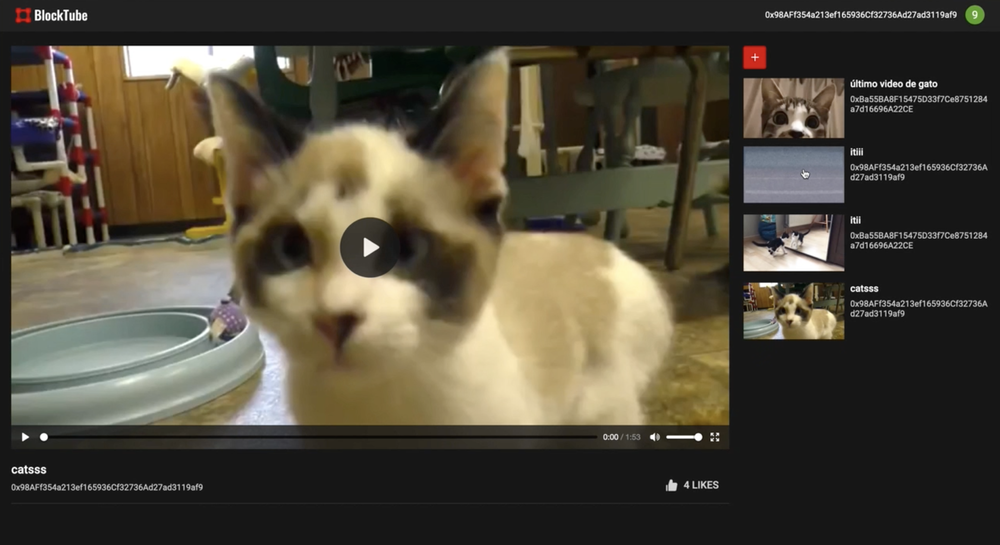
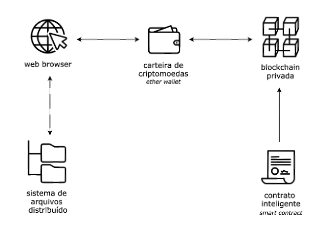

# [CES-27 - Exame: Blockchain] BlockTube

> Alunos: Gabriel Crestani e Rafaella Bambokian - COMP21

### :bangbang: Proposta

A aplicação desenvolvida, denominada BlockTube, é uma plataforma descentralizada para publicar, armazenar e reproduzir vídeos online, além de permitir uma interação entre contas. Executada sobre blockchain e fazendo uso de um sistema de arquivos distribuído, se assemelha, em interface e funcionalidades, a um clone simplificado do já difundido YouTube. No entanto, diferentemente desse, o BlockTube se propõe como uma plataforma livre de censura, além de fazer com que as ações realizadas – upload de vídeos e reações a eles – sejam irreversíveis, dado que funciona sobre uma rede blockchain. A seguir, mais detalhes do projeto são descritos.

### :speech_balloon: Requisitos

_Requisitos funcionais_

- [RF001] O sistema deve permitir o upload de vídeos nos formatos .mp4, .mkv, .ogg, .wmv e .mov, juntamente com um título associado.

- [RF002] O sistema deve listar na interface todos os vídeos em que o upload foi bem-sucedido – cada um deles com o título e a conta do proprietário associados.

- [RF003] O sistema deve permitir a reprodução dos vídeos listados.

- [RF004] O sistema deve permitir que um usuário possa curtir uma vez cada vídeo, sem chance de desfazer a sua interação.

- [RF005] O sistema deve mostrar a quantidade de curtidas para determinado vídeo selecionado da listagem.

- [RF006] O sistema deve mostrar se o usuário já interagiu com o vídeo selecionado, ou seja, se já curtiu o item em questão.

_Requisitos não-funcionais_

- [RNF001] O sistema deve garantir uma interface responsiva para o correto funcionamento em web browser.

-[RNF002] O sistema deve garantir segurança no sentido de que cada usuário realize ações (upload de vídeo ou curtida) identificados apenas pela sua própria conta, não podendo se passar por outro usuário.

- [RNF003] O sistema deve garantir confiabilidade, onde cada ação de um usuário (upload de vídeo ou curtida) será corretamente registrada na rede blockchain.

### :pushpin: Arquitetura

A imagem abaixo representa uma ideia geral da arquitetura do projeto. Nela, é possível compreender o fluxo da aplicação descentralizada desenvolvida. Assim, a partir de um web browser, o usuário se conecta à rede blockchain privada fazendo uso uma carteira de criptomoedas. É na rede em que os dados são persistidos juntamente com todo o código da aplicação, sendo esse definido por um contrato inteligente. Parte dos dados representam referências, indicadas por hash, dos vídeos carregados no sistema de armazenamento de arquivos distribuído – IPFS. Também são salvas as reações a cada vídeo realizadas pelo usuário. Por fim, o sistema de arquivos é capaz de importar os vídeos para a plataforma, ou seja, eles são renderizados no front-end da aplicação para que o cliente possa visualizar e interagir.

Para evidenciar, de maneira detalhada, as tecnologias empregadas no desenvolvimento e na execução, a imagem a seguir é apresentada.

O contrato inteligente foi implementado, compilado e administrado na IDE online [Remix](https://remix.ethereum.org/) – que permite a criação de Ethereum Smart Contracts implementados a partir da linguagem [Solidity](https://docs.soliditylang.org/en/v0.7.4/). A partir dela, foi possível realizar o deploy do contrato na rede privada construída fazendo uso do console [Geth](https://geth.ethereum.org/).
O uso da carteira criptográfica, como já mencionado, se deu pela extensão [Metamask](https://metamask.io/), possibilitando a conexão da aplicação executada no browser diretamente com a rede blockchain privada e permitindo realizar transações em blockchain, garantindo as funcionalidades da aplicação. Em linhas gerais, Ethereum wallet é quem transforma o browser comum em um blockchain browser.
Quanto ao upload de vídeos, essa ação é feita indiretamente no sistema de arquivos descentralizado denominado [IPFS](https://ipfs.io/) – InterPlanetary File System – e sua referência, enquanto identificação em formato hash, é salva no bloco de dados imutável da cadeia em questão para que seja possível acessá-lo.
O front-end da aplicação foi desenvolvido em [React](https://pt-br.reactjs.org/), biblioteca JavaScript capaz de componentizar estruturas de código e, também, definir estados em cada uma delas. O web3.js foi o responsável por conectar o código front-end à rede blockchain, tendo acesso ao contrato e possibilitando ao usuário, além da consulta, a escrita de dados – criação de novos blocos – na rede, a partir de upload de novos vídeos e curtidas em vídeos já listados.

### :checkered_flag: Execução do projeto

Se atentar para as configurações do ambiente descritas ao longo desse documento para que o projeto seja corretamente executado. Ter o [Node.js](https://nodejs.org/en/) instalado em sua máquina, juntamente com as demais tecnologias mencionadas nesse documento.

1. Realizar o deploy do contrato - presente em `./contract/BlockVideo.sol`, fazendo uso da [IDE Remix](https://remix.ethereum.org/), em sua rede blockchain.
2. Em `./client/abis/BlockVideo.json`, criar um novo chave valor dentro de 'networks' tal que a chave seja o network ID e o valor seja o address do contrato (bloco da redeonde se encontra depois que foi realizado o deploy).
3. Ainda na pasta `./client`, rodar o comando `npm install` para que as dependências do projeto React sejam instaladas corretamente.
4. Por fim, executar a aplicação front-end com `npm start` ainda na pasta `./client`.
